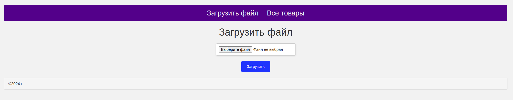
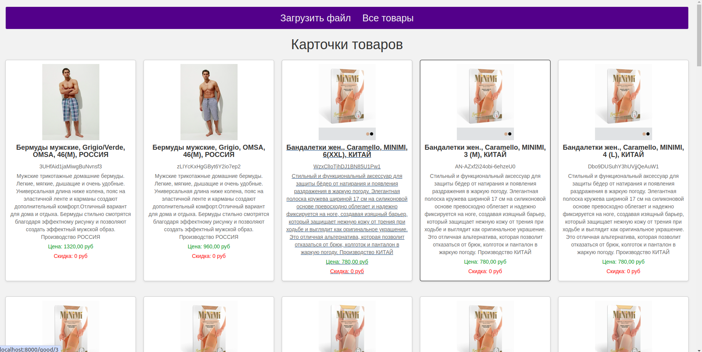
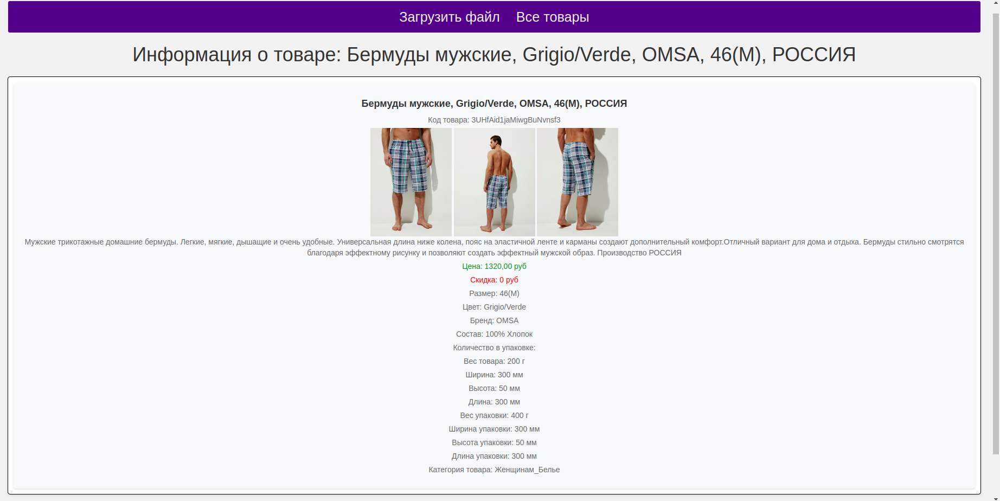

 <h1 align="center">Сервис ImportOfGoods для импорта xlsx-файла для отображения карточек товаров</h1>
  <p> Этот проект реализован с помощью PHP 8.0 , фреймворка Laravel, PostgreSql и Nginx.
 <h2>Описание:</h2>
  <p> Это сервис, в котором можно загрузить xlsx-файл и увидеть карточки товаров из файла, можно посмотреть все товары в формате плитки, либо открыть отдельную курточку товара и посмотреть дополнительные поля.
При импорте файла, сервис скачивает картинки товаров в локальное хранилище, и в таблицу Image записывается полный путь к локальному хранилищу, где расположена картинка.
<h2>Функционал сервиса:</h2>
<ul>

- Импорт xlsx-файла
- Загрузка изображений товаров в локальное хранилище
- Отображение всех товаров в виде плитки. Отображается основная информация: 
    + Изображение упаковки
    + Наименование
    + Внешний код
    + Описание
    + Цена
    + Скидка
- Отображение отдельной карточки товара на всю страницу. Отображается дополнительные поля:
  - Несколько изображений товара.
  - Размер
  - Цвет
  - Бренд
  - Состав
  - Количество в упаковке
  - Вес товара
  - Ширина
  - Высота
  - Длина
  - Вес упаковки
  - Ширина упаковки
  - Высота упаковки
  - Длина упаковки
  - Категория товара
</ul>

<h2>API:</h2>
<ul>

- GET / - Главная страница
- GET /upload_file - Страница загрузки xlsx-файла
- POST /import - Отправка данных xlsx-файла для парсинга и загрузки изображений
- GET /goods - Страница для отображения всех товаров после импорта. Вывод товаров из базы и построение карточек плиткой, элементы являются кликабельными и можно по ним перейти на страницу товара
- GET /good/{id} - Страница Товара(карточка товара). Вывод всей информации, которая есть в базе(доп поля и картинки)
---
</ul>

<h2>Скриншоты:</h2>
Страница загрузки xlsx-файла


Страница товаров


Страница Товара(карточка товара)

<h2>Чтобы запустить проект, выполните:</h2>

Поднять проект:

```make dev-up```
